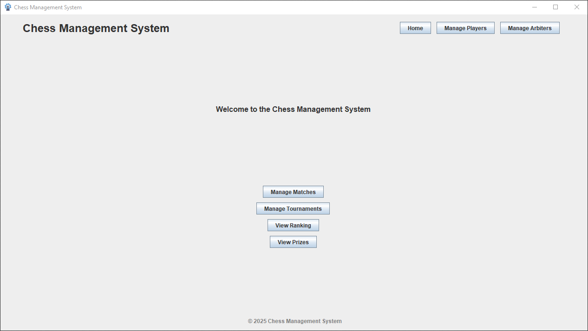

# ChessManager

## System Description

**ChessManager** is a chess tournament management system developed in Java. It allows the administration of individual and team tournaments, supporting different types of tournaments such as single elimination and points-based tournaments. The system manages players, arbiters, matches, and teams, providing a visual interface to view and edit information about the tournaments and their participants.

### System Features

- **Player Management**: Add, edit, delete, and view players participating in the tournaments.
- **Arbiter Management**: Add, edit, delete, and view arbiters overseeing the matches.
- **Match Management**: Schedule, edit, delete, and view individual and team matches.
- **Tournament View**: Display and manage different types of tournaments, including single elimination and points-based tournaments.
- **Ranking View**: Display player rankings based on their performance in the tournaments.
- **Visual Interface**: Provide a graphical user interface for easy interaction with the system.

## Technologies Used

- **Java**: The main programming language used for developing the application.
- **Java Swing**: Used for building the graphical user interface (GUI).

### How to Run the System

1. **Clone the repository**:
    ```sh
    git clone https://github.com/kalebeccs/chessmanager-ipluso.git
    ```
2. **Navigate to the project directory**:
    ```sh
    cd chessmanager-ipluso
    ```
3. **Compile the project**:
    ```sh
    javac -d bin src/main/java/**/*.java
    ```
4. **Run the application**:
    ```sh
    java -cp bin src.main.java.Main
    ```

## Project Structure

```plaintext
src/
└── main/
    ├── java/
    │   ├── application/
    │   ├── controllers/
    │   ├── models/
    │   └── views/
    │       ├── arbiter/
    │       ├── base/
    │       ├── matches/
    │       │   ├── doubles/
    │       │   └── single/
    │       ├── player/
    │       └── tournaments/
    └── resources/
        └── images/
```

## Preview

